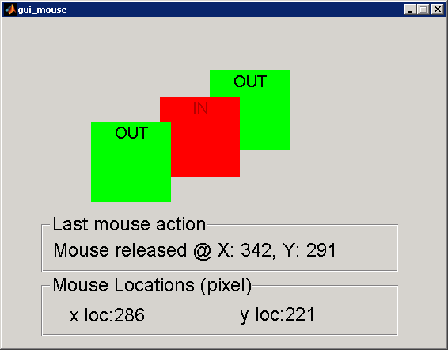

matlab-mouse
============

A quick demo for tracking mouse movement and actions in matlab gui.

**TODO**: 
* modify drag_and_drop so it can be attach not just label. 

setfigptr.m was downloaded from [Matlab File Exchange](http://www.mathworks.com/matlabcentral/fileexchange/9855-simplified-management-of-figure-pointer-property/content/setfigptr.m).
